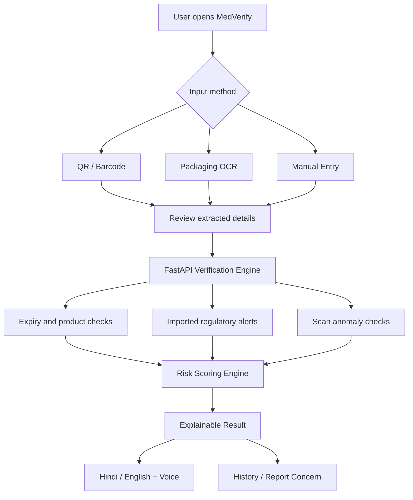
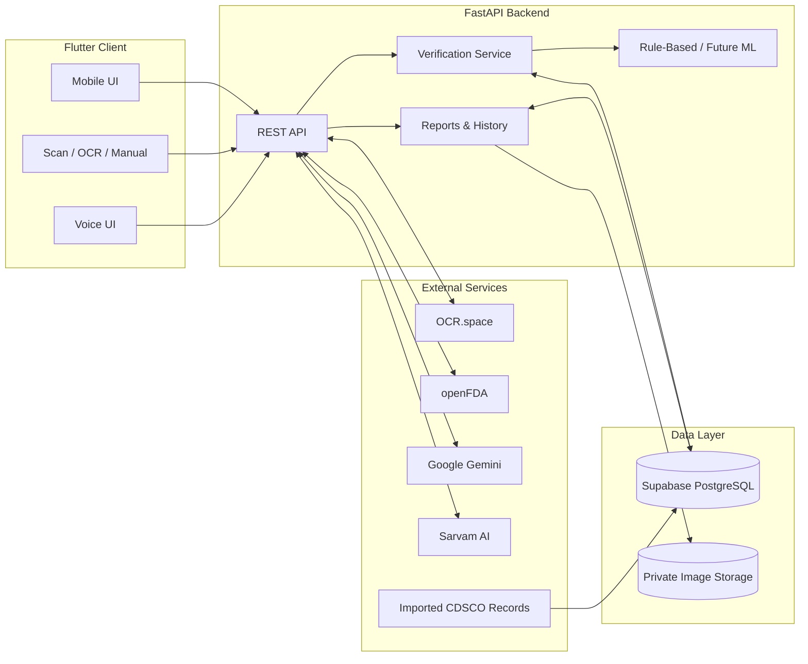

<div align="center">


# MedVerify
### Smart Medicine Verification System

**Safer Medicines. Informed Decisions. Accessible Healthcare.**


[](https://python.org)
[](https://fastapi.tiangolo.com)
[](https://flutter.dev)
[](https://supabase.com)
[](LICENSE)

[Features](#-key-features) · [Architecture](#-system-architecture) · [Quick Start](#-quick-start) · [API](#-api-overview) · [Roadmap](#-roadmap)

</div>

---

## 📖 Overview

**MedVerify** is an AI-assisted medicine screening and awareness platform designed to help people identify **potentially expired, regulator-flagged, tampered, or otherwise suspicious medicines**. Users can scan QR/barcodes, photograph packaging for OCR, or enter medicine details manually. MedVerify compares available information with curated medicine records and imported regulatory alerts, explains possible concerns, and supports reporting.

Built with **rural accessibility** in mind, the experience emphasizes clear Hindi/English explanations, a voice-enabled assistant, and multiple input methods.

> [!IMPORTANT]
> MedVerify is a **screening and public-awareness tool**, not a laboratory authentication system. A low concern score or no matching alert **does not prove a medicine is genuine, safe, or appropriate to take**. Seek advice from a pharmacist or qualified healthcare professional when concerned.

## 📑 Table of Contents

- [Overview](#-overview)
- [The Problem and Our Approach](#-the-problem-and-our-approach)
- [Key Features](#-key-features)
- [How It Works](#-how-it-works)
- [System Architecture](#-system-architecture)
- [Technology Stack](#-technology-stack)
- [Project Structure](#-project-structure)
- [Quick Start](#-quick-start)
- [Environment Configuration](#-environment-configuration)
- [API Overview](#-api-overview)
- [Risk Assessment](#-risk-assessment)
- [Data Sources and Limitations](#-data-sources-and-limitations)
- [Testing](#-testing)
- [Deployment](#-deployment)
- [Roadmap](#-roadmap)
- [Security and Privacy](#-security-and-privacy)
- [Contributing](#-contributing)
- [License](#-license)

## 🎯 The Problem and Our Approach

Medicine packaging can be difficult to interpret, particularly where access to reliable information, digital literacy, and language support is limited. MedVerify makes basic screening information easier to access without requiring specialized knowledge.

| Challenge | MedVerify approach |
|---|---|
| Hard-to-read labels | Camera OCR with editable extracted details |
| Expiry uncertainty | Date parsing and clear expiry warnings |
| Known regulatory concerns | Matching against imported CDSCO NSQ/spurious drug alerts |
| Language and literacy barriers | Hindi/English explanations and voice interaction |
| Suspicious product encounters | Structured reporting and optional packaging photos |
| Need for traceability | Scan history and admin review workflows |

## ✨ Key Features

| Capability | Description |
|---|---|
| 📷 QR / barcode scanning | Decode supported QR, retail barcode and GS1 identifiers |
| 🔎 OCR extraction | Read printed product, batch, manufacturing and expiry details |
| ⌨️ Manual entry | Verify information without a readable code or photo |
| 🗓️ Expiry checks | Identify expired and near-expiry information |
| 🏛️ Regulatory alerts | Compare available records with imported CDSCO notices |
| 🧩 Anomaly screening | Identify suspicious serialized scan patterns and possible packaging anomalies |
| 📊 Explainable risk scoring | Rule-based concern score, designed for future ML replacement |
| 🗣️ Hindi voice assistance | Sarvam-powered speech recognition and speech synthesis |
| 🤖 AI explanations | Gemini-assisted accessible explanations grounded in scan results |
| 🚩 Suspicious medicine reports | Submit concerns and supporting evidence |
| 🕘 Scan history | Retrieve previous verification checks |
| 🛡️ Admin dashboard | Review reports, import alerts and inspect aggregate trends |

> Features described here reflect the planned/implemented backend modules. Live behavior depends on configured credentials, database records, provider availability and frontend integration.

## 🔄 How It Works



## 🏗️ System Architecture



## 🧰 Technology Stack

| Layer | Technologies |
|---|---|
| Frontend | Flutter, Hindi/English localization |
| Backend | Python, FastAPI, Pydantic v2, SQLAlchemy 2.0 |
| Database | Supabase PostgreSQL, Alembic migrations |
| Storage | Supabase Storage |
| OCR / Images | OCR.space, OpenCV, Pillow |
| Barcode | GS1 parsing and supported decoding libraries |
| AI Chat | Google Gemini |
| Voice | Sarvam AI STT / TTS |
| Drug information | Curated medicine records, CDSCO alert imports, openFDA (supplementary) |
| Testing | Pytest |
| Deployment | Docker, Render |

## 📁 Project Structure

```text
Med-Verify/
├── app/
│   ├── main.py
│   ├── api/              # REST routers
│   ├── services/         # Verification, OCR, AI, voice, risk
│   ├── models/           # Database models
│   ├── schemas/          # Request/response validation
│   ├── core/             # Configuration and security
│   └── database/         # Database connection and seed utilities
├── alembic/             # Database migrations
├── scripts/             # Demo and maintenance scripts
├── tests/               # Automated tests
├── assets/              # README visuals
├── requirements.txt
├── Dockerfile
├── docker-compose.yml
├── render.yaml
├── FLUTTER_INTEGRATION_GUIDE.md
├── .env.example
└── README.md
```

## 🚀 Quick Start

**Prerequisites:** Python 3.12+, Git, a configured Supabase project and any external API credentials for integrations you want to use.

```bash
# Clone the repository
git clone https://github.com/archisharma158-cmd/Med-Verify.git
cd Med-Verify

# Switch to the backend branch (if your code is there)
git switch backend

# Create a virtual environment
python -m venv .venv

# Windows PowerShell
.venv\Scripts\Activate.ps1

# macOS / Linux alternative: source .venv/bin/activate

# Install dependencies
pip install -r requirements.txt

# Configure your local environment
# Copy .env.example to .env, then fill in your own credentials

# Apply database migrations
alembic upgrade head

# Start the API
uvicorn app.main:app --reload
```

Open **http://127.0.0.1:8000/docs** for interactive Swagger documentation, or **http://127.0.0.1:8000/** for the application status response.

## 🔐 Environment Configuration

Create a local `.env` (never commit it):

```dotenv
SARVAM_API_KEY=your_sarvam_api_key
OCR_SPACE_API_KEY=your_ocr_space_api_key
OPENFDA_API_KEY=your_optional_openfda_key
GEMINI_API_KEY=your_gemini_api_key
SUPABASE_URL=your_supabase_project_url
SUPABASE_SECRET_KEY=your_server_side_supabase_key
```

Additional database connection variables may be required by the actual SQLAlchemy configuration; check `app/core/config.py` and `.env.example`. Keep the Supabase secret key on the server only.

## 🔌 API Overview

The reported backend includes these route groups. Confirm exact methods and payloads in `/docs` and `FLUTTER_INTEGRATION_GUIDE.md`.

| Route prefix | Purpose |
|---|---|
| `/health` | Health diagnostics |
| `/api/auth` | Authentication and profiles |
| `/api/verify` | Medicine verification |
| `/api/barcode` | QR and barcode processing |
| `/api/ocr` | Packaging text extraction |
| `/api/medicines` | Medicine lookup |
| `/api/alerts` | Regulatory alert lookup |
| `/api/packaging` | Packaging analysis |
| `/api/chat` | AI chatbot |
| `/api/voice` | Hindi voice input/output |
| `/api/reports` | Suspicious product reporting |
| `/api/history` | Scan history |
| `/api/admin` | Administrative functions |

## 📊 Risk Assessment

The current architecture supports a **rule-based screening score**, with a swappable interface for future trained ML models.

| Score | Screening category | Interpretation |
|---|---|---|
| 0–25 | 🟢 Low concern | No major concern detected in completed checks |
| 26–60 | 🟡 Medium concern | Some issues or inconsistencies need attention |
| 61–100 | 🔴 High concern | Significant warning or regulatory match may require action |

**Scores are prototype heuristics, not validated probabilities of authenticity or safety.** Missing data must remain visible as uncertainty. Any confirmed expiry or applicable regulatory alert must be highlighted independently of the numeric score.

## 🗂️ Data Sources and Limitations

- **CDSCO:** Official Indian NSQ/spurious drug notices imported from documented public sources. Not a live authentication API.
- **openFDA:** Supplementary US-centered drug information, not proof of authenticity for Indian batches.
- **Curated medicine database:** Coverage and trust depend on the provenance of each record.
- **Manufacturer batch confirmation:** Requires authoritative manufacturer or supply-chain data; cannot be inferred from batch formatting alone.
- **Duplicate scanning:** Repeated batch numbers are normal; suspicious patterns require additional evidence such as unique serialization.

Seeded demonstration records must be labeled **synthetic/demo** unless verified against authoritative sources.

## 🧪 Testing

```bash
pytest -v
```

The development report shared for this project listed **16 passing automated tests** covering key routes and services. This is a reported development result, **not an independent production audit**. Validate real external integrations, migrations, authorization and deployed behavior separately.

## ☁️ Deployment

Deployment assets include `Dockerfile`, `docker-compose.yml` and `render.yaml`.

1. Provision PostgreSQL/Supabase and configure required migrations.
2. Add secret environment variables to the hosting platform.
3. Deploy the FastAPI service using the included Render blueprint or Docker setup.
4. Verify health checks, `/docs` access policy, CORS origins, storage permissions and API integration.
5. Connect the Flutter client to the deployed API base URL.

Never publish real API keys or unrestricted administrative endpoints.

## 🛣️ Roadmap

- [x] FastAPI modular backend architecture (reported)
- [x] Verification, OCR, barcode, alerts and reporting modules (reported)
- [x] Rule-based risk scoring interface (reported)
- [x] Hindi voice and AI chatbot service integration code (reported)
- [ ] Validate all third-party APIs end to end in deployment
- [ ] Complete Flutter integration and accessibility testing
- [ ] Expand verified Indian medicine and alert coverage
- [ ] Train, evaluate and validate an ML risk model with appropriate labeled data
- [ ] Implement model monitoring, calibration and explainability
- [ ] Field-test with rural users and healthcare professionals

## 🔒 Security and Privacy

MedVerify is designed to use authenticated access, authorization, upload validation, API rate limits and private storage. Before public deployment, test row-level ownership, administrative permissions, retention policies and safe handling of optional location information.

## 🤝 Contributing

Contributions, accessibility feedback and reproducible bug reports are welcome. Open an issue describing the problem, steps to reproduce and expected behavior. For code contributions, create a feature branch and submit a pull request. **Do not include patient data, secrets or unverified drug-safety claims.**

## 📄 License

See [LICENSE](LICENSE) for the repository's license terms.

---

<div align="center">

### 💙 Making medicine safety information accessible to everyone.

**MedVerify · Safe Medicines • Trusted Health**

[⬆ Back to top](#medverify)

</div>
